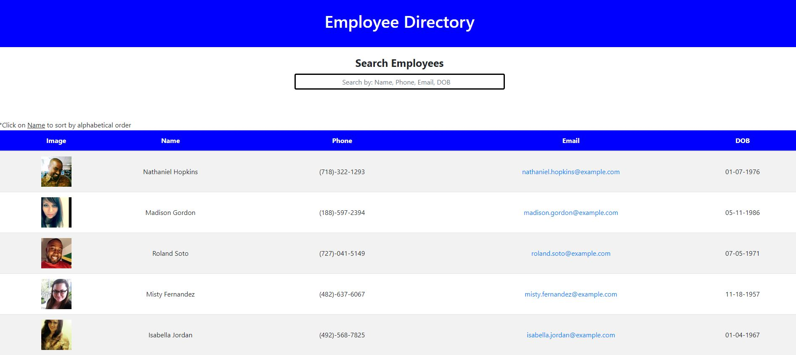

# React Employee Directory

## Table of Contents
- [Description](#descriptiongo)
- [Installation Instructions](#installgo)
- [Usage](#usagego)
- [Authors](#authorgo)
- [Deployed Links](#deployedgo)
- [Questions](#contactgo)
        
## Description

An employee directory created in React. THe app allows an employee or manager to view the entire employee directory.

## Installation Instructions

React
## Usage

A user can view an entire employee directory at once so that they have quick access to thier information. The user can filter the employees by name to easily find a specific employee
## License

MIT License

## Authors

Shawn A. Rather

## Deployed

https://sar-sa.github.io/React-Employee-Directory/
## Questions

Refer to github or send email with any questions:

SAR-SA

sarsa.web@gmail.com
